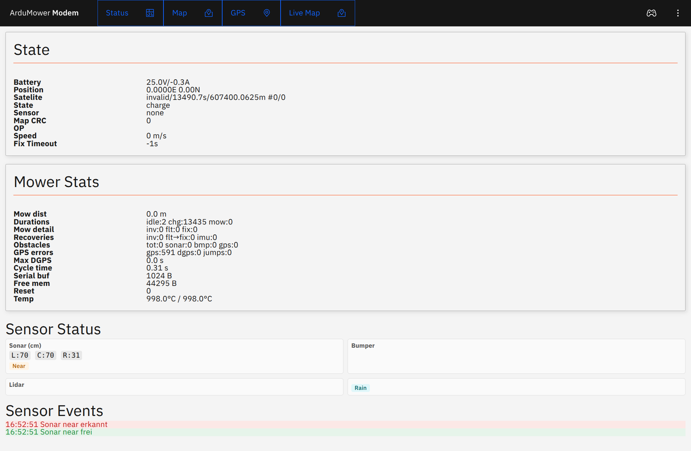
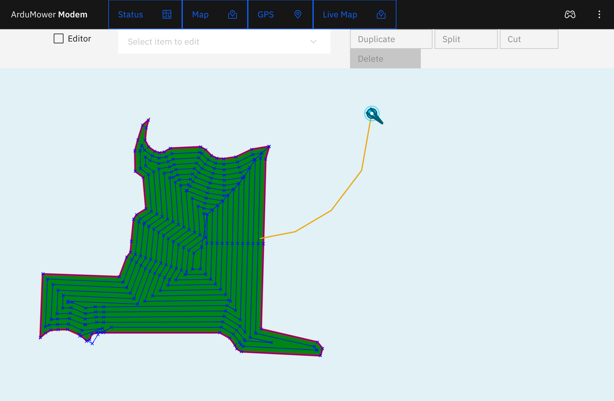
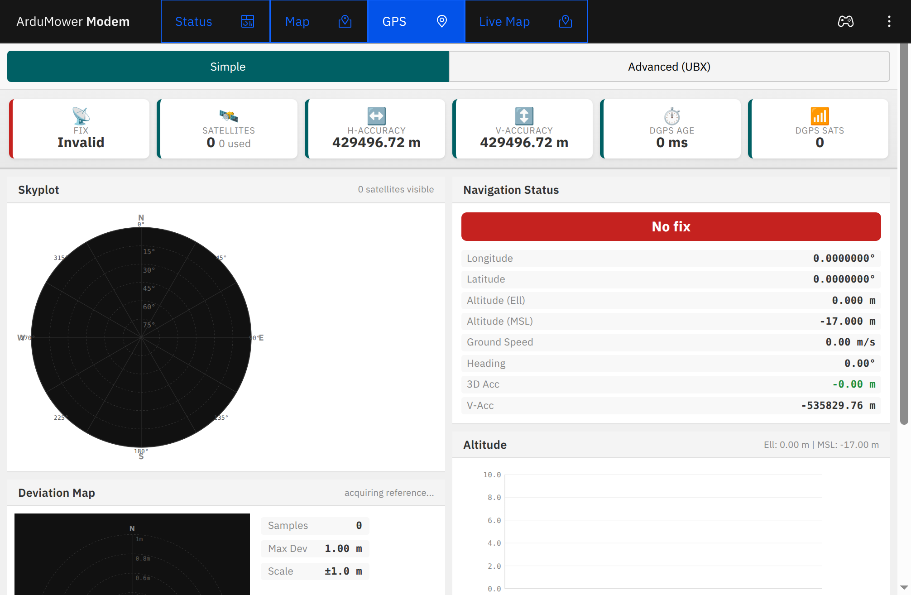
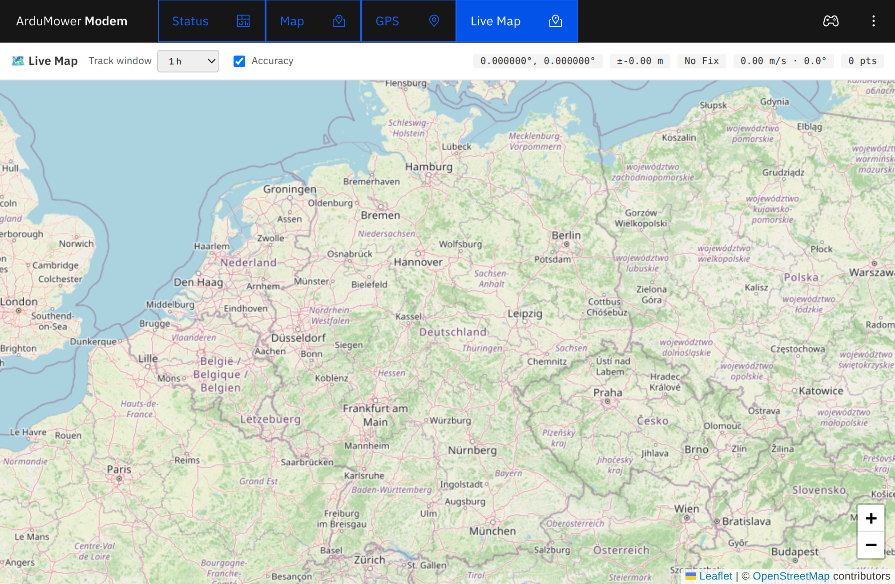
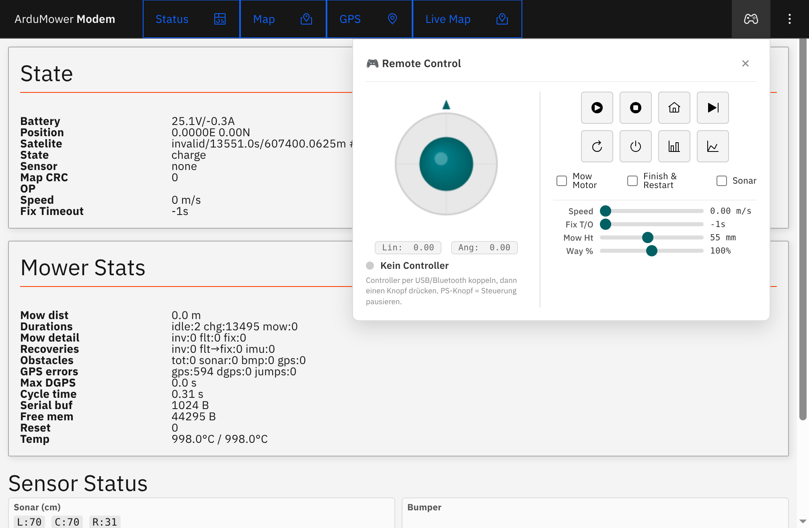
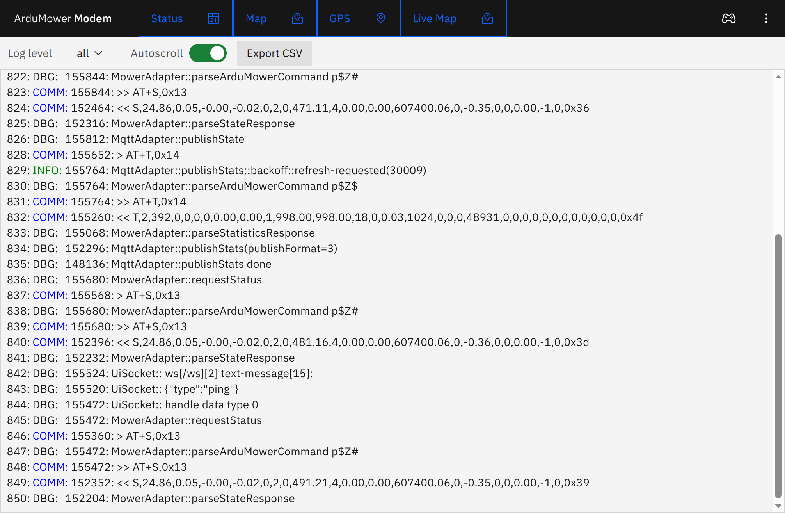
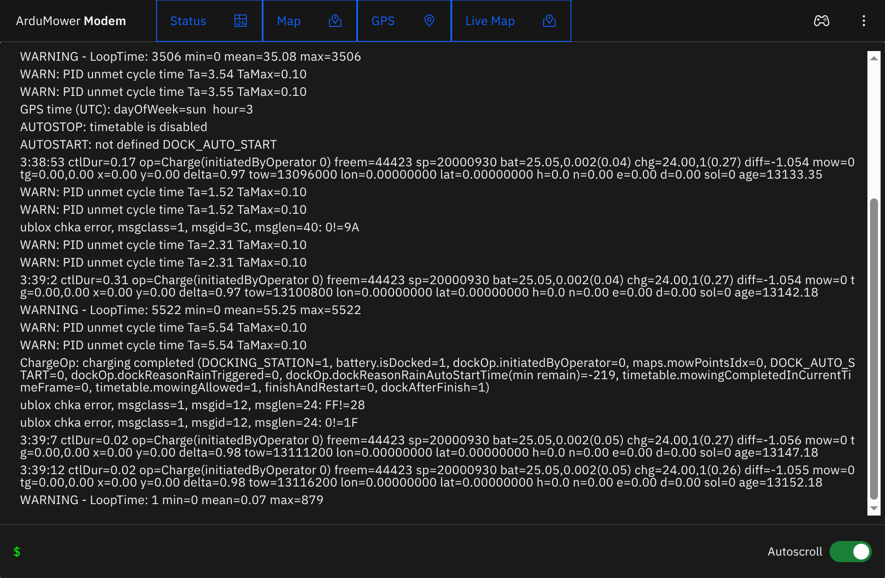
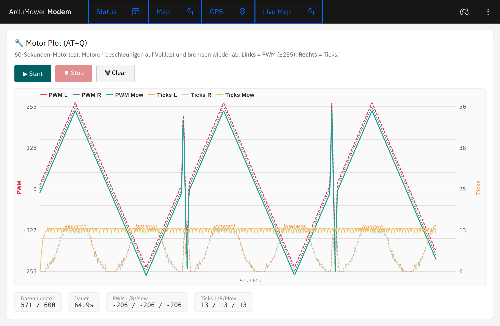
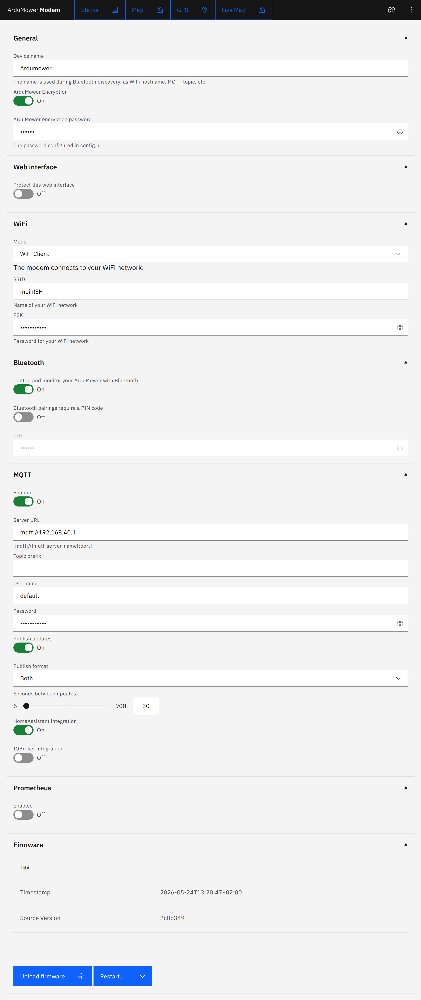

# ArduMower ESP Modem

This is a Arduino project for the ESP32 companion of the [ArduMower](https://www.ardumower.de/).
It provides the same Bluetooth LE and HTTP connectivity as the `esp32_ble` Sketch from the [Sunray](https://github.com/ardumower/Sunray) repository.

It also offers support for MQTT and Prometheus to ease the integration of ArduMower into home automation and monitoring setups.

## License

ArduMower Modem - Firmware for the ESP32 connected as Modem to an ArduMower
Copyright (c) 2022 Tim Otto

Permission is hereby granted, free of charge, to any person obtaining a copy
of this software and associated documentation files (the "Software"), to deal
in the Software without restriction, including without limitation the rights
to use, copy, modify, merge, publish, distribute, sublicense, and/or sell
copies of the Software, and to permit persons to whom the Software is
furnished to do so, subject to the following conditions:

The above copyright notice and this permission notice shall be included in all
copies or substantial portions of the Software.

THE SOFTWARE IS PROVIDED "AS IS", WITHOUT WARRANTY OF ANY KIND,
EXPRESS OR IMPLIED, INCLUDING BUT NOT LIMITED TO THE WARRANTIES OF
MERCHANTABILITY, FITNESS FOR A PARTICULAR PURPOSE AND NONINFRINGEMENT.
IN NO EVENT SHALL THE AUTHORS OR COPYRIGHT HOLDERS BE LIABLE FOR ANY CLAIM,
DAMAGES OR OTHER LIABILITY, WHETHER IN AN ACTION OF CONTRACT, TORT OR
OTHERWISE, ARISING FROM, OUT OF OR IN CONNECTION WITH THE SOFTWARE OR THE USE
OR OTHER DEALINGS IN THE SOFTWARE.

## Requirements

Before building or flashing the firmware, install the following tools:

- Node.js and npm (required for building the web UI)
- Go (required for packaging the web UI into `src/asset_bundle.h`)
- PlatformIO CLI (recommended for firmware builds)
- Arduino CLI (optional, only required for `task compile`)
- `task` from [Taskfile](https://taskfile.dev/) to run the repository automation tasks

## Flashing the ArduMower Modem firmware

Flashing the firmware onto the ESP32 for the first time requires some effort. Subsequent updates can be installed comfortably using the web interface of the Modem.

### Pre-built binaries

Download the latest release binary from the [releases page](https://github.com/timotto/ardumower-modem/releases). Use the [modem_install](util/modem_install/modem_install.ino) Arduino Sketch (from the `util` folder of the release) to flash it onto your ESP32. This Sketch requires nothing but a vanilla Arduino setup with the ESP32 package installed. No additional libraries are required.

### Compiling with PlatformIO (recommended)

Install [PlatformIO](https://platformio.org/) and run:
```
task compile-pio PIO_ENV=esp32-S3-N16-R8
```
For the ESP32 variant:
```
task compile-pio PIO_ENV=esp32
```

The `compile-pio` task depends on `package-ui`, so the UI is built and packaged automatically before the firmware build starts.

If `pio` is not on your PATH, the Taskfile currently calls the local PlatformIO venv executable at `~/.platformio/penv/bin/pio`.

### Compiling with Arduino CLI

Install the [Arduino CLI](https://github.com/arduino/arduino-cli) and the ESP32 core, then run:
```
task compile ESP_TARGET=esp32 VARIANT=ESP_MODEM_APP
```
For ESP32-S3:
```
task compile ESP_TARGET=esp32-S3 VARIANT=ESP_MODEM_APP
```

**Note for ESP32-S3:** When using an ESP32-S3 with 16 MB flash (e.g., `esp32-s3-devkitc-1`), the partition scheme `default_16MB.csv` is required. In PlatformIO this is configured via `board_build.partitions = default_16MB.csv` in the S3 environment (see `platformio.ini`).

## First time WiFi setup

Once the firmware is running it will start a WiFi access point called `ArduMower Modem` with the password `ArduMower Modem`. Connect to that access point to access the Modem's web interface at [http://192.168.4.1/](http://192.168.4.1/). From there you are able to configure your WiFi credentials, Bluetooth security settings and everything else.

## Features

The web interface provides full insight and control over the ArduMower.

### Dashboard

#### Status



Real-time status overview including battery, position, satellite info, state, sensor data, speed, fix timeout, mower stats (distances, durations, recoveries, obstacles, temperatures), and sensor events.

#### Map



Visualizes the mower map with perimeter, docking station, mowing points, and tracks.

#### GPS



Detailed GPS information with satellite skyplot, position data, and signal quality. Requires a customized Sunray firmware that includes the GPS details response.

#### Live Map



Real-time tracking on an OpenStreetMap background with configurable track window and accuracy overlay.

### Remote Control



Full manual control of the mower including:
- Virtual joystick for driving (linear/angular speed)
- Start, Stop, Dock, Skip Waypoint, Reboot, Power Off buttons
- Request Stats and Request Status buttons
- Mow motor toggle, Finish & Restart, Sonar
- Adjustable speed, fix timeout, mowing height, and waypoint percentage

### Log



Filterable, searchable log output with configurable log level, autoscroll, and CSV export.

### Terminal



Interactive terminal to send commands to the mower and view responses in real time. Available on the ESP32-S3 variant (requires `MOWER_TERMINAL` compile flag). Requires the Sunray firmware to be configured with an additional serial connection (`Serial2`) for the terminal communication.

### Motor-Test



Motor plot test (60s motor ramp test) with safety confirmation and live PWM/tick visualization.

### Settings



Configuration of WiFi, Bluetooth, MQTT, Prometheus, PS4 controller, and OTA updates. OTA flashing of the Sunray firmware (STM32) requires trigger lines (`BOOT0` on GPIO 5, `NRST` on GPIO 7) between the ESP32 and the STM32.

### Integrations

#### MQTT

The ArduMower Modem supports MQTT for status reporting and control. It has support for HomeAssistant Autodiscovery as a vacuum cleaner and ioBroker integration. This integrates nicely with Google Assistant, and I'm pretty sure with Alexa as well.

#### Prometheus

The Prometheus endpoint of the ArduMower Modem makes it easy to collect metrics about the ArduMower and the Modem.

#### PS4 Controller / Gamepad

The robotic lawnmower can be controlled with a gamepad. Multiple controller brands are supported, not only PS4. The controller can be connected via a computer, laptop, or smartphone.

- left joystick -> fast movements
- right joystick -> slow movements
- cross + R2 -> linear movements + rotation on the spot
- triangle -> start automatic mowing
- rectangle -> stop automatic mowing
- circle -> mowing motor on/off
- cross -> skip next mowing point
- L1 -> reduce mowing speed
- R1 -> increase mowing speed

Configuration is done via the web interface.

**Note for ESP32-S3:** The S3 variant lacks Bluetooth Classic hardware, so direct PS4 controller pairing is not supported. Instead, use joystick input via the browser (Web Gamepad API) or system-integrated joysticks on a connected computer/laptop/smartphone.


## Dependencies

### Development Environment

The sketch is compiled with [PlatformIO](https://platformio.org/). All automation is orchestrated by a [Taskfile](https://taskfile.dev/).
Building the web interface requires Node JS. The tools to package the web interface and to run the validation tests require Go.


### Arduino Libraries

All libraries are managed via PlatformIO:

- [NimBLE-Arduino](https://github.com/h2zero/NimBLE-Arduino) - Bluetooth LE connectivity
- [ArduinoJson](https://arduinojson.org/) - JSON serialization
- [MQTT](https://github.com/256dpi/arduino-mqtt) - MQTT client for home automation
- [AUnit](https://github.com/bxparks/AUnit) - Unit testing
- [ArduinoWebsockets](https://github.com/gilmaimon/ArduinoWebsockets) - WebSocket communication
- [AsyncTCP](https://github.com/ESP32Async/AsyncTCP) - Async TCP library
- [ESPAsyncWebServer](https://github.com/ESP32Async/ESPAsyncWebServer) - Async web server

### Automation

[Taskfile.yml](Taskfile.yml) defines tasks for compilation, upload, and more. Compilation can be done either via PlatformIO (`compile-pio`) or via Arduino CLI (`compile`).

**Key tasks:**

| Task | Description |
|------|-------------|
| `build-ui` | Build the web UI |
| `package-ui` | Package web UI as a header file |
| `compile-pio` | Compile with PlatformIO |
| `compile` | Compile with Arduino CLI |
| `build` | Build all variants (firmware, sim, test) |
| `build-firmware` | Build the firmware variant |
| `flash` | Flash firmware via serial |
| `run` | Build + flash + serial monitor |
| `ota` | Update firmware via OTA |
| `validate` | Run integration tests |
| `clean` | Remove build artifacts |

**Task parameters (as environment variables or via `--`):**

| Variable | Default | Description |
|----------|---------|-------------|
| `ESP_TARGET` | `esp32` | Target platform (`esp32` or `esp32-S3`) |
| `VARIANT` | `ESP_MODEM_APP` | Build variant (`ESP_MODEM_APP`, `ESP_MODEM_SIM`, `ESP_MODEM_TEST`) |
| `PIO_ENV` | `esp32-S3-N16-R8` | PlatformIO environment |
| `SERIAL_PORT` | – | Serial port for flash/monitor |
| `ESP_DEV_IP` | – | ESP IP address for OTA |
| `ESP_DEV_CREDS` | – | OTA credentials (`user:pass`) |

Example:
```
task compile-pio PIO_ENV=esp32
task flash SERIAL_PORT=/dev/ttyUSB0 VARIANT=ESP_MODEM_SIM
task ota ESP_DEV_IP=192.168.43.221 ESP_DEV_CREDS=admin:secret
```

## Gratitude

My ArduMower is my only lawn mower. It saved me countless hours of manual labor which I was able to spend tinkering with this source code and other hobbies.

I am very grateful to the ArduMower community for building an awesome hardware and software platform and making it available to the public. With this contribution I want to become an active member of the ArduMower community.
