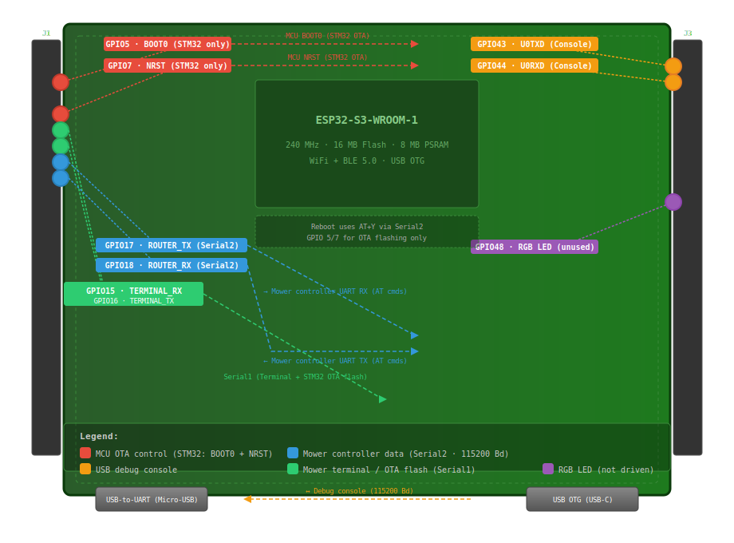

# ESP32-S3 Pinout

## Board

The **ESP32-S3-DevKitC-1** (with ESP32-S3-WROOM-1 module, 16 MB flash, 8 MB PSRAM) is used as the development board.

Alternatively, the **ESP32-S3-WROOM-1 module can be soldered directly onto a custom PCB**. The pinout and firmware are identical. Additional components required:
- **3.3V voltage regulator** (e.g., AMS1117-3.3) for module power from 5V
- **USB-to-UART bridge** (e.g., CP2102 or CH340C) for the serial console (GPIO43/44) and flashing
- **5V power supply** (from mower PSU or USB)



## Connections (ArduMower Modem)

| Pin | Signal      | Direction | Connected to           | Description |
|-----|-------------|-----------|------------------------|-------------|
| 5   | BOOT0       | Output    | MCU BOOT0 (STM32 only) | OTA flashing: set STM32 to flash mode |
| 7   | NRST        | Output    | MCU NRST (STM32 only)  | STM32 reset control for OTA |
| 15  | TERMINAL_RX | Input     | Mower controller UART  | Terminal + OTA flash (Serial1, MOWER_TERMINAL) |
| 16  | TERMINAL_TX | Output    | Mower controller UART  | Terminal + OTA flash (Serial1, MOWER_TERMINAL) |
| 17  | ROUTER_TX   | Output    | Mower controller UART RX | Serial data to mower (commands) |
| 18  | ROUTER_RX   | Input     | Mower controller UART TX | Serial data from mower (status, sensors) |
| 43  | TX (U0TXD)  | Output    | USB-Serial             | Serial console (USB-to-UART) |
| 44  | RX (U0RXD)  | Input     | USB-Serial             | Serial console (USB-to-UART) |
| 48  | RGB LED     | Output    | onboard                | Addressable RGB LED (status indicator) |

## Pin Details

### Mower Controller Communication (Serial2)

Communication with the mower controller (Sunray STM32, Ardumower GrandCentral M4, or any MCU running Sunray-compatible firmware) uses UART on **GPIO17 (TX)** and **GPIO18 (RX)** at 115200 baud. This is the main AT command channel (Router).

These pins are configured in `platformio.ini`:
```
-D ROUTER_TX_PIN=17
-D ROUTER_RX_PIN=18
```

### Terminal + OTA Flash (Serial1, MOWER_TERMINAL)

When compiled with the `MOWER_TERMINAL` flag, **Serial1** serves two purposes — it is shared between the interactive web terminal and the STM32 OTA firmware flasher. The terminal is suspended during OTA flashing to free the serial port.

The pins are **not fixed** — `Serial1.begin()` uses the board's default UART1 pins, but these must be set to different GPIOs than the Router (Serial2) to avoid conflicts.

On ESP32-S3, Serial1 defaults to **GPIO 16 (TX)** and **GPIO 15 (RX)** — these are different from the Router pins (GPIO 17/18), so no conflict occurs. If you need to change them, use:
```cpp
Serial1.begin(115200, SERIAL_8N1, RX_PIN, TX_PIN);
```

### OTA Flashing (STM32 Sunray only)

When using an STM32-based Sunray board, OTA flashing requires two things:
1. **Serial1** (same port as Terminal, above) — for the actual firmware data transfer using the STM32 ROM bootloader protocol
2. Two control lines to put the STM32 into bootloader mode:

| Function | GPIO | Signal |
|----------|------|--------|
| BOOT0    | 5    | HIGH = flash mode, LOW = run mode |
| NRST     | 7    | LOW pulse to reset STM32 |

Defined in `src/stm32ota/stm32ota.h`:
```cpp
#define BOOT0_PIN 5
#define NRST_PIN 7
```

OTA update sequence:
1. Set BOOT0 HIGH (flash mode)
2. Pulse NRST LOW (reset STM32)
3. STM32 starts in flash mode → transfer firmware via Serial1
4. Set BOOT0 LOW (run mode)
5. Pulse NRST LOW (reset STM32)
6. STM32 starts with new firmware

**Note:** GPIO 5/7 are only needed for OTA flashing of STM32-based boards. On an Ardumower GrandCentral M4 (SAMD51), OTA flashing works differently and GPIO 5/7 are not required.
The **Reboot** button in the web interface uses the `AT+Y` command over Serial2 (GPIO 17/18) and works with any Sunray-compatible firmware — it does **not** use GPIO 5/7.

### Serial Console (USB)

GPIO43 (TX) and GPIO44 (RX) are connected to the USB-to-UART bridge (CP2102) and serve as the debug console (115200 baud).

### RGB LED

GPIO48 drives the onboard addressable RGB LED (revision v1.0) or GPIO38 (revision v1.1).
The `Led` class in `src/led.h`/`src/led.cpp` can drive a GPIO as a status LED but is currently **not instantiated anywhere in the firmware**. The RGB LED is therefore **not actively driven by firmware**.
<!-- If needed, create an instance like `Led gpioLed(48, true);` in esp_modem.cpp. -->

## Power Supply

- **5V** via USB-to-UART port (Micro-USB) or ESP32-S3 USB port (USB-C)
- Alternatively via **5V** and **GND** at J1-21 / J1-22

## Important Notes

- GPIO35, GPIO36, GPIO37 are used internally on modules with Octal SPI flash/PSRAM and are **not** available for external use.
- The ESP32-S3 uses 3.3V logic levels — ensure your external hardware is compatible.
- Pins 19 (USB_D-) and 20 (USB_D+) are reserved for the native USB-OTG port.
